# Celechron 1.3.0 启发的 CampusOS 官方插件集设计

**状态：** 已接受，分阶段实现中  
**日期：** 2026-07-19  
**参考版本：** Celechron `1.3.0` / tag commit `ceab2a4372df64588a934d4eb2204ac1b142e5cd`  
**目标：** 将 Celechron 中已验证的大部分学生能力重构为可独立安装、可替换数据源、共享真实基础设施的 CampusOS 官方插件集

## 1. 决策摘要

Celechron 的功能值得迁移，但不能把 Flutter 页面或 `Spider` 直接改写成一个超大的 `academic-scraper` 插件。CampusOS 应采用三层结构：

1. **核心基础设施不是插件。** 认证、业务 Session、受控 HTTP、刷新互斥、缓存 provenance、诊断、通知、数据库事务和插件沙箱必须由主程序统一提供。
2. **连接器插件只负责数据源。** 本科教务、研究生教务、学在浙大、素拓、在线校历和校园卡各自维护协议、解析器与来源状态，不直接渲染产品页面。
3. **功能插件只消费版本化能力。** 课表、考试、成绩、DDL、实践、任务规划、系统日历和搜索依赖 `academic.timetable@1` 之类的能力契约，而不是依赖某个具体插件 ID 或直接 import 连接器。

这允许本科与研究生连接器提供同一组学业能力，也允许未来其他学校替换连接器而不重写功能插件。

### 1.1 实现检查点（2026-07-19）

首个可运行纵向切片已经完成：Manifest v2 校验、能力依赖解析、provider 冲突与循环依赖 fail closed、逐项权限授权、主进程持久化、headless 生命周期、刷新 single-flight、来源状态存储，以及内置 `org.campusos.zju-undergraduate` 与 `org.campusos.zju-graduate` 连接器。连接器通过核心托管的 service-session broker 发布同版本 profile、课表、考试和成绩能力，不能读取密码、Cookie、Session、token 或 ticket；核心复用内存业务会话、失效后受控重认证，只向连接器开放固定操作。

本科连接器按运行时日期探测当前和下一学年；研究生连接器使用独立 CAS service 与内存 token，按当前/下一学年查询四个授课学季和考试学季。两者都隔离坏记录并使用账号/provider 隔离的 provenance 缓存；研究生精确周次原样保留，缺少明确钟点的考试不伪造时间。原始 profile、课表、考试和成绩能力已经注册为 collection，可同时绑定本科与研究生 provider。`org.campusos.zju-learning` 已通过独立业务 `session` 和固定 `/api/todos` 发布 `learning.assignments@1`。考试与 DDL 无头功能插件通过显式刷新依赖向多 provider `calendar.events@1` 发布带来源、原始 ID、时区和上游 provider 的统一事件；工作区不再直接依赖具体连接器。`org.campusos.academic-grades` 通过主进程校验 manifest dependency、runtime binding 和当前验证账号的只读 capability IPC 展示多来源成绩，激活的 activity view 自动生成入口。设置页首次连接已按显式培养层次分别验证本科教务/素拓和研究生 token/成绩结构，新凭据保存 v4 培养层次，旧 v3 本科回执保持兼容。`.campusmod` 已完成检查、权限确认、原子安装升级、完整性复核、动态注册与卸载；严格本地单视图 profile 可经 Electron 43 Chromium sandbox + 独立 origin iframe 激活，其他包不执行。第三方 headless QuickJS/WASM 内层资源 POC 已通过，但 utility process 外层、权限代理和 lifecycle 尚未开放。研究生真实账号验收、可信节次时间和课程事件、完整成绩口径/隐私遮罩、第三方进程级资源回收和 schema migration 仍待实现，Phase 0 和最小学业闭环都不能据此标记为全部完成。

## 2. 参考与许可证边界

本设计通过只读检查 Celechron 1.3.0 的页面、模型、HTTP 服务、刷新协调、缓存、诊断和测试目录得到。重点参考路径见 [Celechron 1.3.0 校内数据接入参考基线](../references/celechron-1.3.0-ingestion-baseline.md)，架构决策见 [ADR-0001：能力驱动的插件运行时](../adr/0001-capability-driven-plugin-runtime.md)。

Celechron 使用 GPL-3.0，CampusOS 当前核心与官方插件计划使用 MIT。以下工作只允许提取产品行为、协议状态机、失败场景和领域概念，不得复制、逐行翻译、机械改写或移植 Celechron 源码。任何代码级复用必须先单独通过许可证 ADR。

## 3. Celechron 功能盘点

| Celechron 能力 | 主要来源/实现 | CampusOS 归属 | 迁移判断 |
| --- | --- | --- | --- |
| ZJUAM 统一认证、CAS ticket、服务 Session | `zjuam.dart`、各业务 service login | 核心认证与 Session Broker | 必须共享，禁止插件读取密码或 Cookie |
| 本科课表、课程、考试、成绩、主修成绩 | 本科教务网 `zdbk.dart` | 本科教务连接器 | 高优先级 |
| 研究生课表、课程详情、考试、成绩 | 研究生院 `grs_new.dart`、`grs_spider.dart` | 研究生教务连接器 | 高优先级，提供与本科一致的领域能力 |
| 学在浙大作业和 DDL | `courses.dart`、`/api/todos` | 学习平台连接器 + DDL 助手 | 高优先级 |
| 二/三/四课堂汇总与实践项目明细 | `sztz.dart`、`getMyInfo`、`getSqjl` | 素拓连接器 + 实践档案 | 高优先级；当前仅有最小汇总验证 |
| 课表视图、单双周、短长学期、线上课程 | `Semester`、`Session`、课表页面 | 课表插件 | 高优先级 |
| 考试列表、时间、地点、座位、倒计时 | `Exam`、考试页面 | 考试中心插件 | 高优先级 |
| 五分制、4.3/4.0、百分制、主修均绩、加权试算 | `Grade`、GPA helper、weighted GPA 页面 | 成绩与 GPA 插件 | 中优先级；敏感数据默认隐藏 |
| 课程详情、教师、学分、课程搜索 | `Course`、课程列表/详情/搜索页面 | 学业概览 + 全局搜索 | 中优先级 |
| 月历、日程、接下来时间线 | calendar/flow 页面 | 现有日历工作台插件 | 保留并改为能力聚合器 |
| 用户任务、固定日程、重复、耗时与进度 | task 页面与模型 | 任务管理插件 | 中优先级，纯本地可先实现 |
| 按 DDL 自动安排工作段/休息段 | `arrange.dart`、flow controller | 自动规划插件 | 中优先级，必须独立测试算法 |
| 系统日历同步、按学期选择、iCal 导出 | `calendar_to_system.dart`、`calendar_to_ical.dart` | 日历桥接插件 | 中优先级 |
| 在线校历、节次时间、节假日、调休、多级回退 | calendar config/time service | 在线校历连接器 | 高优先级，是课表展开的基础 |
| 地点名称映射 | `location_mapper.dart` | 校历/地点 enrichment | 作为共享领域 enrichment，不单独做页面插件 |
| 校园卡账号与动态付款码 | `ecard.dart`、付款码页面 | 校园卡插件 | 后置；动态令牌风险高，不得缓存 |
| 后台刷新、成绩变动和 DDL 通知 | background refresh、local notifications | 核心调度 + 各功能插件策略 | 核心执行，插件只注册策略 |
| 诊断日志、脱敏 TXT、来源状态 | diagnostics、`DataSourceStatus` | 核心诊断中心 | 核心切片已完成，后续扩展重试与重登明细 |
| 主题、版本检查、关于、许可证 | option/credits/GitHub service | 主程序设置 | 不做业务插件 |
| Android 小组件与移动端后台机制 | worker、Pigeon、WorkManager | 暂不迁移 | 桌面 MVP 无对应价值 |

## 4. 插件宿主必须先升级

当前 `PluginManifest`、静态 `loadPlugins()` 和 `PluginComponentProps` 只能支持编译期 React 页面，不能承载上述真实插件集。

| 当前缺口 | 风险 | Plugin Runtime v2 要求 |
| --- | --- | --- |
| 官方 renderer 仍由静态 import，第三方只开放受限 iframe profile | headless 与高权限包不能安全激活 | 已有注册表与 renderer sandbox v1；补齐 worker/isolate 与权限代理 |
| manifest 没有 `provides/requires` | 插件只能靠硬编码互相认识 | 版本化能力注册与依赖解析 |
| 只有 UI Component，没有 headless contribution | 连接器只能伪装成页面 | 支持 connector、sync job、command、settings、search provider |
| renderer 直接加载官方插件 | 网络、文件、凭据边界无法可信执行 | 数据源代码在主进程受控 worker/沙箱中运行 |
| `credential` 是一个宽权限字符串 | 插件可能被设计成读取密码 | 删除直接凭据读取，改为不透明的 service-session request capability |
| 所有插件只收到一个大快照 | 无法表达来源、版本、局部失败和权限最小化 | 按 capability 查询只读领域 repository |
| 没有 schema migration 和插件命名空间 | 升级可能破坏缓存或跨插件读写 | 版本化 schema、事务迁移、隔离存储 |
| 没有事件总线和刷新作业 | 插件会各自轮询并发生覆盖 | 统一 refresh coordinator + typed domain events |
| 没有 API 版本兼容检查 | 宿主升级后插件可能静默损坏 | `apiVersion`、semver 范围和 fail-closed 激活 |

在 Runtime v2 完成前，不应继续新增“看起来像插件、实际只能读全局 mock 快照”的业务包。

## 5. 能力契约

### 5.1 Manifest v2 方向

```json
{
  "id": "org.campusos.zju-undergraduate",
  "version": "1.0.0",
  "apiVersion": "2",
  "kind": "connector",
  "provides": [
    "academic.course-catalog@1",
    "academic.timetable@1",
    "academic.exams@1",
    "academic.grades@1"
  ],
  "requires": [
    "core.auth.zju-service-session@1",
    "core.refresh@1",
    "core.provenance-store@1"
  ],
  "optionalRequires": ["academic.calendar-config@1"],
  "permissions": [
    "auth:service:zdbk.zju.edu.cn",
    "network:https://zdbk.zju.edu.cn",
    "storage:domain:academic"
  ],
  "contributes": {
    "syncJobs": ["refresh-academic"],
    "settings": ["undergraduate-source"]
  }
}
```

字段只表达设计方向，具体 schema 在实现 Runtime v2 时用共享 TypeScript 类型和 JSON Schema 同步定义。

### 5.2 核心能力

| 能力 | 责任 |
| --- | --- |
| `core.auth.zju-service-session@1` | 用已保存凭据完成 CAS，向连接器提供绑定服务、不可导出 Cookie 的请求句柄 |
| `core.http@1` | 域名白名单、超时、正文上限、取消、重试分类 |
| `core.refresh@1` | 前台/后台/定时刷新 single-flight、局部成功、取消和进度 |
| `core.provenance-store@1` | 账号/来源/学期隔离缓存、schema 校验、实时/缓存/默认/不可用状态 |
| `core.domain-events@1` | 领域快照更新事件，不传原始响应 |
| `core.notifications@1` | 系统通知调度、去重、权限和 quiet hours |
| `core.diagnostics@1` | 结构化日志、来源状态和导出脱敏 |
| `core.search-index@1` | 本地索引写入与受权限查询 |
| `core.calendar-write@1` | 向 CampusOS 日历写事件，保证来源 ID 和幂等更新 |

### 5.3 领域能力

| 能力 | 核心输出 |
| --- | --- |
| `academic.profile@1` | 培养层次、入学年份、账号范围；不含凭据 |
| `academic.course-catalog@1` | 课程、教学班、教师、学分、来源标识 |
| `academic.timetable@1` | 学期、周次、单双周、节次、地点、实际日期事件 |
| `academic.exams@1` | 考试类型、时间、地点、座位、来源状态 |
| `academic.grades@1` | 当前 v1：课程、原始成绩、学分、明确返回的绩点、学年和学期；计入 GPA/主修标记待契约升级 |
| `academic.calendar-config@1` | 学期边界、节次时间、假期、调休、配置来源 |
| `learning.assignments@1` | 作业、课程、可空截止时间、原始来源 ID；不臆造来源未明确提供的完成状态 |
| `practice.records@1` | 二/三/四课堂汇总、项目、审核状态和来源 |
| `tasks.local@1` | 用户任务、固定日程、重复规则、预计/已用时间 |
| `planner.schedule@1` | 自动安排的工作段、休息段、不可行原因和计划版本 |
| `campus.card@1` | 卡账户摘要和短生命周期付款码句柄 |
| `calendar.events@1` | 统一后的课程、考试、DDL 和用户任务事件流 |

## 6. 官方插件清单

### 6.1 数据连接器插件

| 插件 | 提供能力 | 关键行为 | 优先级 |
| --- | --- | --- | --- |
| `zju-undergraduate` | course-catalog、timetable、exams、grades、profile | 本科教务 CAS、下一学年探测、主修成绩、单条解析隔离 | P1 |
| `zju-graduate` | course-catalog、timetable、exams、grades、profile | 研究生院 token/Session、课程详情补全、特殊周次 | P1 |
| `zju-learning` | learning.assignments | 学在浙大作业、登录过期重认证、缓存回退 | P1 |
| `zju-practice` | practice.records | 素拓正式 SESSION、非匿名 ctx、明细/汇总并行、教务汇总回退 | P2 |
| `zju-calendar-config` | academic.calendar-config | 在线配置、同学期缓存、最后有效模板、安全默认 | P1 |
| `zju-campus-card` | campus.card | e-life 服务认证、卡账户、一次性付款码 | P4 |

本科与研究生连接器可以同时安装；profile、课表、考试和成绩是显式 collection contract，消费者必须按绑定 provider 合并并保留来源。其他未注册为 collection 的能力仍必须拒绝无规则的双 provider 冲突；后续身份识别只负责默认授权和展示策略，不得通过隐藏数据伪造单来源。

### 6.2 用户功能插件

| 插件 | 必需能力 | 用户功能 | 优先级 |
| --- | --- | --- | --- |
| `academic-timetable` | timetable、calendar-config | 学期课表、单双周/自定义周次、课程详情、地点与冲突 | P1 |
| `academic-exams` | exams | 考试列表、倒计时、地点/座位、日历事件、提醒 | P1 |
| `academic-grades` | grades | 首个纵向切片已完成原始成绩、明确绩点加权、真实刷新与账号隔离；多算法、主修均绩、试算和隐私遮罩待续 | P2（进行中） |
| `academic-overview` | course-catalog；可选 exams/grades | 课程、学分、考试数量和学业摘要 | P2 |
| `deadline-assistant` | assignments；可选 tasks.local | DDL 列表、近 24 小时/7 天、课程归并、提醒策略 | P1 |
| `practice-portfolio` | practice.records | 三课堂汇总、审核中/已计入项目、类别和活动时间 | P2 |
| `task-manager` | core storage，提供 tasks.local | 本地任务、固定/重复日程、预计用时、进度、暂停/继续 | P3 |
| `auto-scheduler` | tasks.local、calendar.events，提供 planner.schedule | 可用时段、工作/休息段、截止前排程、不可行解释 | P3 |
| `calendar-workspace` | calendar.events；可选 planner.schedule | 月历、连续日程、日视图、接下来时间线和统一详情 | P1；由现有 `calendar` 演进 |
| `calendar-bridge` | calendar.events、core calendar export；可选 planner.schedule | 系统日历同步、学期选择、幂等删除、iCal 导出 | P3 |
| `universal-search` | core.search-index；可选各领域能力 | 搜索课程、考试、DDL、任务和实践项目 | P3 |
| `campus-card-wallet` | campus.card | 卡片选择、动态付款码、到期倒计时和手动刷新 | P4 |

现有 `materials` 插件继续独立存在，不属于 Celechron 迁移范围；`dingtalk-entry` 也不进入本依赖图。

## 7. 插件依赖关系图

实线由 provider 指向能力、再由能力指向必需的 consumer；虚线表示可选能力。核心服务箭头不是源码 import。所有插件都由 Plugin Runtime v2 管理，连接器和功能插件不得直接持有密码、SSO Cookie 或其他插件的存储句柄。

```mermaid
flowchart TB
  subgraph Core["CampusOS Core（不可替换基础设施）"]
    Runtime["Plugin Runtime v2\n生命周期 · 能力解析 · 权限"]
    ConnectorSDK["Connector Services\nAuth · HTTP · Refresh"]
    Store["Domain Store + Provenance\n事务 · 账号/来源/学期隔离"]
    Support["Diagnostics · Notifications\nSearch Index · Calendar Write"]
  end

  subgraph Connectors["数据连接器插件"]
    UG["zju-undergraduate"]
    GR["zju-graduate"]
    Learn["zju-learning"]
    Practice["zju-practice"]
    CalConfig["zju-calendar-config"]
    CardSource["zju-campus-card"]
  end

  subgraph Capabilities["版本化领域能力"]
    Catalog["academic.course-catalog@1"]
    TimetableData["academic.timetable@1"]
    ExamData["academic.exams@1"]
    GradeData["academic.grades@1"]
    Assignments["learning.assignments@1"]
    PracticeData["practice.records@1"]
    CalendarConfig["academic.calendar-config@1"]
    CardData["campus.card@1"]
    Tasks["tasks.local@1"]
    Events["calendar.events@1"]
    Plan["planner.schedule@1"]
  end

  subgraph Features["用户功能插件"]
    Timetable["academic-timetable"]
    Exams["academic-exams"]
    Grades["academic-grades"]
    Overview["academic-overview"]
    Deadlines["deadline-assistant"]
    Portfolio["practice-portfolio"]
    TaskManager["task-manager"]
    Scheduler["auto-scheduler"]
    Calendar["calendar-workspace"]
    Bridge["calendar-bridge"]
    Search["universal-search"]
    Wallet["campus-card-wallet"]
  end

  Runtime --> ConnectorSDK
  Runtime --> Store
  Runtime --> Support
  ConnectorSDK --> UG
  ConnectorSDK --> GR
  ConnectorSDK --> Learn
  ConnectorSDK --> Practice
  ConnectorSDK --> CalConfig
  ConnectorSDK --> CardSource

  UG --> Catalog
  UG --> TimetableData
  UG --> ExamData
  UG --> GradeData
  GR --> Catalog
  GR --> TimetableData
  GR --> ExamData
  GR --> GradeData
  Learn --> Assignments
  Practice --> PracticeData
  CalConfig --> CalendarConfig
  CardSource --> CardData
  TaskManager --> Tasks
  Scheduler --> Plan

  TimetableData --> Timetable
  ExamData --> Exams
  GradeData --> Grades
  Catalog --> Overview
  ExamData -.-> Overview
  GradeData -.-> Overview
  CalendarConfig --> Timetable
  Assignments --> Deadlines
  PracticeData --> Portfolio
  Tasks -.-> Deadlines
  Tasks --> Scheduler

  Timetable --> Events
  Exams --> Events
  Deadlines --> Events
  TaskManager --> Events
  Events --> Scheduler
  Events --> Calendar
  Events --> Bridge
  Plan -.-> Calendar
  Plan -.-> Bridge
  Catalog -.-> Search
  ExamData -.-> Search
  Assignments -.-> Search
  PracticeData -.-> Search
  Tasks -.-> Search
  CardData --> Wallet
```



## 8. 关键交互和数据规则

### 8.1 刷新

- 用户点击一次刷新，核心创建一个 refresh ID，并按账号协调所有连接器。
- 每个连接器独立返回 `live/cache/fallback/unavailable`，某一来源失败不能回滚其他来源成功结果。
- 功能插件订阅事务提交后的领域事件，不订阅抓取过程中的半成品。
- 刷新中禁止旧任务覆盖新任务；后台任务遇到活跃前台刷新时让行。

### 8.2 认证

- 插件只能申请具体业务服务，例如 `auth:service:sztz.zju.edu.cn`。
- 核心返回绑定域名和 CookieJar 的请求句柄，不返回密码、Cookie、Session 或 ticket 字符串。
- 每个服务必须完成自己的非匿名或账号匹配验证，不能把 ZJUAM 登录成功等同于业务登录成功。
- 当前核心中的素拓最小 `getMyInfo` 回执可继续作为连接证明；完整实践数据在 Runtime v2 完成后迁入 `zju-practice`，不得同时维护两份刷新逻辑。

### 8.3 隐私与敏感数据

| 数据 | 分类 | 默认策略 |
| --- | --- | --- |
| 课表、考试、DDL、任务 | 个人信息 | 本地存储，可单来源删除 |
| 成绩、GPA、座位号、实践记录 | 敏感个人信息 | 明确安装/启用同意，界面支持遮罩，禁止遥测 |
| 校园卡账户与付款码 | 高风险动态凭证 | 付款码只保存在内存，离开页面或到期立即清除 |
| 密码、Cookie、Session、ticket、token | 凭据 | 仅核心安全边界处理，永不进入插件、日志或领域数据库 |

### 8.4 日历事件统一

课表、考试、DDL 和用户任务归一为 `calendar.events@1`，事件必须包含稳定来源 ID、原始对象 ID、时间范围、时区、更新时间和 provenance。自动规划单独提供带计划版本的 `planner.schedule@1`，日历和导出插件在读取时叠加，避免 `calendar.events` 与规划器形成激活循环。日历插件只负责展示与用户编辑覆盖，不解析任何校内接口。

## 9. 实施顺序

### Phase 0：先完成 Plugin Runtime v2

- headless connector 与主进程生命周期
- `provides/requires/optionalRequires` 能力解析和 semver 检查
- 不透明 service-session request capability
- 插件命名空间存储、schema migration 和事务
- refresh coordinator、provenance、诊断中心和 `calendar.events@1` 多 provider 基础切片已完成；课程事件与 schema migration 待实现
- 官方插件与社区插件信任等级；官方也不得绕过凭据边界

**出口条件：** 缺失依赖、冲突 provider、API 版本不兼容、权限拒绝和迁移失败均 fail closed；自动化测试能证明插件拿不到密码和 Cookie。

### Phase 1：最小真实学业闭环

- `zju-calendar-config`
- `zju-undergraduate` 与 `zju-graduate`
- `academic-timetable`
- `academic-exams`
- `zju-learning` 与 `deadline-assistant`
- `calendar-workspace` 迁移到 `calendar.events@1`

**出口条件：** 本科/研究生至少各一组自有账号验证；课表、考试和 DDL 可局部成功并进入现有日历；mock adapter 只保留为开发 fixture。

### Phase 2：学业分析与实践

- `academic-grades`（首个纵向切片已完成）
- `academic-overview`
- `zju-practice` 与 `practice-portfolio`

**出口条件：** 成绩和实践必须显式启用；GPA 算法有固定 fixture；素拓实时、缓存、教务汇总和保留旧数据四级路径可测试。

### Phase 3：个人时间管理

- `task-manager`
- `auto-scheduler`
- `calendar-bridge`
- `universal-search`

**出口条件：** 自动规划可解释不可行原因；重复任务、跨日任务、课程冲突、时区和 iCal 幂等导出通过测试。

### Phase 4：高风险可选能力

- `zju-campus-card`
- `campus-card-wallet`

**出口条件：** 动态码不落盘、不进入截图缓存和诊断日志；页面失焦、到期、锁屏和退出均清理内存令牌。

## 10. 测试矩阵

- Runtime：依赖拓扑排序、循环依赖、provider 冲突、可选依赖缺失、API 版本不兼容、激活回滚。
- 权限：域名越权、跨插件存储、凭据读取、未授权通知、敏感 capability 未同意。
- 连接器：真实协议实现 + 外部 HTTP fixture；匿名业务身份、过期 Session、超时、重试、单条脏数据、缓存不覆盖。
- 刷新：同账号 single-flight、不同来源局部成功、前后台竞争、旧刷新不得覆盖新状态。
- 消费者契约：本科和研究生 provider 对同一领域 contract 运行同一套 contract tests。
- UI：来源状态、缓存标记、敏感遮罩、空态、错误态、键盘和移动宽度。
- 规划算法：确定性、截止时间、不可用时段、休息压缩、不可行解释和属性测试。
- 校园卡：动态令牌零持久化、零日志、生命周期清理。
- 许可证：构建产物不得包含 `.tmp/celechron-1.3.0` 或 Celechron 源文件；新增实现保留独立设计与测试证据。

## 11. 当前包迁移

| 当前包 | 处理 |
| --- | --- |
| `academic-scraper` | 停止扩张；Runtime v2 后拆为本科/研究生/学习平台/素拓连接器 |
| `calendar` | 重命名或演进为 `calendar-workspace`，改为消费 `calendar.events@1` |
| `materials` | 保留；未来消费 course-catalog 与学习平台资料能力，不与学业连接器合并 |
| `dingtalk-entry` | 保持占位，与本插件集无依赖 |

## 12. 完成定义

本设计不是“创建一批带名称的占位 React 包”。任一插件只有同时满足以下条件才可标记 `active`：

- 真实主进程执行链、权限检查、错误传播和持久化已实现。
- 外部数据可以 fixture/mock，但认证、刷新、缓存、IPC 和 UI 行为不能伪造。
- manifest 依赖和 capability contract 已验证。
- 具备实时、缓存、默认或不可用的明确来源状态。
- 敏感字段不进入日志，用户可删除该插件产生的数据。
- 有自动化测试和至少一次自有账号脱敏验收。
