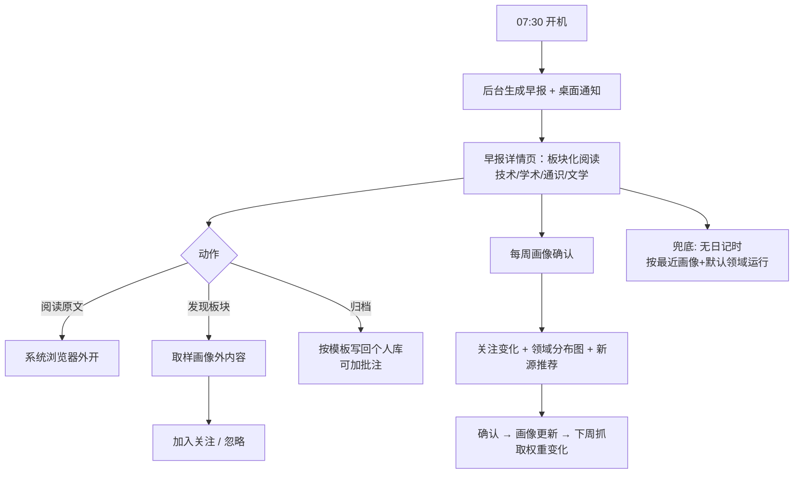

# Execution Plan — 个人早报（Daily Brief）

> **⚠️ 已暂停（2026-08-25 用户决议）：** 早报已移出官方模块名单并暂停开发；代码与 IPC 保留未删除（`plugins/official/daily-brief` + main 注册的 brief handler），不挂载、不进入左侧栏/引导推荐。本文件及本目录其余文件是暂停前的历史规划/调研记录，不作为实施依据；恢复前须重新立项。当前模块集合见 CONTEXT.md。

**Date:** 2026-08-22（v3：校园信息拆分 + AI library 调研后修订）
**Tier:** T2 · S3
**Related docs:** [PRD](PRD.md) · [research](research.md) · [questions](questions.md)

> _Build roadmap。单独读这份的人周一早上就该知道先干什么。_

---

## TL;DR

- **平台：** CampusOS Windows 桌面（现有 Electron 应用），CampusOS 是**看板/中间站**，个人数据库外置（Obsidian 等本地 Markdown，仅作画像依据）
- **栈：** 复用现有地基 —— Electron/React/Zustand/SQLite、`aiProviderAdapters`、通知中心/提醒调度、天气 provider 的外源抓取模式
- **新增模块：** personal-DB connector（读本地 Markdown）、资讯 connector（RSS+预设+白名单）、画像服务、早报合成服务、早报视图（`日报/画像/设置` 二级 tab）
- **明确不做：** 校园信息（独立插件另立项）、今日安排/时间块建议/日程写入（归 Schedule）、应用内嵌浏览器、移动端、RAG/记忆框架依赖
- **Timeline：** 4 个阶段，约 8–10 周（单人）
- **第一个里程碑：** 手填兴趣清单 + 2–3 个预设源 → 早报详情页能出全中文板块化摘要

---

## 1. User journey

### Text walkthrough

**Step 1 — 清晨。** 07:30 开机。CampusOS 后台自动生成今日早报，桌面通知"今日早报已生成"。打开早报详情页。

**Step 2 — 板块化阅读。** 详情页分板块：**技术/AI**（3 条）、**学术**（2 条，含 arXiv 摘要）、**通识**（1 条）、**文学/网络报刊**（1 条，订阅的连载更新）—— 配额由 AI 按画像权重分配，全中文，每条一句话摘要 + 可展开 + "阅读原文"外开浏览器。

**Step 3 — 破茧发现。** 页脚"发现"板块 1–2 条画像外内容："本周 AI Agent 领域有 3 个新工具你未订阅，已为你取样 1 条 —— 为什么推荐给你：与你的'自动化'兴趣相邻"。点击可"加入关注"或"忽略"。

**Step 4 — 归档。** 某条摘要很有价值 → 点"归档" → 按约定模板写入个人库（Obsidian 的 `archive/daily-brief/` 或类似目录），可加一句个人批注。整期也可归档。

**Step 5 — 每周画像确认。** 周日早报附"本周关注变化"：新增领域"数字孪生"（来自周三日记）、减弱领域"游戏开发"；附本周**领域分布图**（各领域占比 vs 目标，茧房显性化）与 1–3 个**新源推荐**。一键确认 → 画像更新，下周抓取权重与配额随之变化。

**Step 6 — 兜底。** 某天没写日记：早报按最近一次确认的画像 + 默认领域运行；画像区提示"本周日记较少，可手动编辑"。

### Mermaid

---

## 2. Platform recommendation

**CampusOS Windows 桌面端**（现状即平台）。原因：

- **看板定位**：用户已确认"以 CampusOS 为看板/中间站，以其他项目/软件作为个人数据库/画像依据"
- **地基复用**：AI provider、通知链、抓取先例、SQLite 都是现成的
- **职责清晰**：日程/提醒归 Schedule，校园信息归独立插件，早报只做外部信息聚合与画像

**不做：** 独立 App / 浏览器扩展 / 微信推送；不引入 RAG 知识库平台或 AI 记忆框架（research 11.7 结论）。

---

## 3. Stack recommendation（复用 + 新增）

| 层 | 复用现有 | 新增 |
|---|---|---|
| 抓取 | 天气 provider 模式（主进程 fetch + 缓存 + 降级，`deskCalendarWindow.ts`） | 资讯 connector（RSS 用 `rss-parser`、白名单校验）；personal-DB connector（读本地 Markdown + frontmatter，仅画像依据） |
| AI | `aiProviderAdapters`（OpenAI/DeepSeek/Anthropic/Gemini）+ safeStorage key | 早报合成 prompt（板块化 + 配额分配 + 破茧取样）、画像提炼 prompt（输出领域权重） |
| 存储 | SQLite（`databaseService.ts`，v1–v3） | migration v4+：画像表（含权重）、早报缓存表、资讯去重指纹、归档记录 |
| 展示 | 详情路由、`shell.openExternal` | 早报详情页（板块化）、画像编辑页、领域分布图 |
| 提醒 | 通知中心 + 提醒调度 | 早报生成调度（开机/手动）、早报通知类型 |
| 边界 | ADR-0004 确认提交 | 一次性 onboarding consent（日记→LLM），实现时形成新 ADR |

---

## 4. Phase breakdown

### Phase 0 — 早报管线切片（1–2 周）

**Goal：** 先证明"多源聚合 + AI 摘要"的日报价值，不依赖个人库与画像。

**Scope：** 手填兴趣清单（无 Obsidian）；2–3 个预设公开源（如 arXiv、Hacker News、InfoQ）→ 主进程抓取 → AI 生成板块化全中文摘要 → 早报详情页 + 手动刷新；摘要卡片 + 原文外开。

**技术规格：** [phase0-spec.md](phase0-spec.md) —— 模块/数据模型/IPC/prompt/测试已细化，可直接照此实现。

**Success metrics：** 自己连续 5 个工作日打开早报 ≥3 天；生成成功率 ≥95%。
**Kill criterion：** 1 周内打开 <3 次 → 聚合摘要对用户无价值，砍早报或改形态。

### Phase 1 — 画像与个人库接入（2–3 周）

**Scope：** personal-DB connector（直接读本地 Markdown：Daily Notes + `interests/` + frontmatter）；AI 每周提炼画像（直接转发本周日记，用户已决策效率优先），**输出领域权重**；确认 UI（新增/减弱领域 + 领域分布图）；手动兜底编辑；画像写入 SQLite v4；抓取配额改为按画像权重分配。

**Success metrics：** 画像每周确认率 ≥80%；无日记时手动兜底可用；权重生效后早报板块比例与画像一致。
**Kill criterion：** 连续 2 周提炼结果与用户自评偏差大且不愿确认 → 降级为纯手动清单。

### Phase 2 — 信息源扩展与破茧（2–3 周）

**Scope：** RSS 订阅管理（用户可增删源）；白名单网页抓取；**发现板块**（画像外取样 1–2 条 + "为什么推荐"）+ 每周新源推荐；可选增强：**本地语义检索**（embedding + SQLite-vec/ChromaDB，借鉴 personal-semantic-search-mcp 思路，让"找画像依据"更准）。

**Success metrics：** 抓取成功率 ≥90%；发现板块周点击 ≥1 次。
**Kill criterion：** 发现板块连续 4 周零点击 → 关掉破茧配额，只保留新源推荐。

### Phase 3 — 归档与提醒打磨（1–2 周）

**Scope：** 归档（单条/整期可选，按模板写回个人库，可加批注）；开机自动生成 + 桌面通知 + 通知中心；设置页（板块开关、配额、生成时机、归档目录、整体关闭）；consent 记录与 ADR（一次性 onboarding + 设置页可关）。

**Success metrics：** 早报周查看率 ≥70%；归档 ≥2 条/周；因打扰关闭通知 <10%。
**Kill criterion：** 周查看率 <40% 且归档为 0 → 早报未形成习惯，评估砍掉或改形态。

> **校园信息插件**为独立立项（见 [research](research.md) 11.2），不在本计划内；如需共享画像，两插件各自跑通后以 capability 协作。

---

## 5. Metrics rollup

| Phase | North Star | Target | Kill threshold | Key inputs |
|---|---|---|---|---|
| 0（管线） | 早报打开率 | 5 个工作日 ≥3 天 | 1 周 <3 次 → 砍 | 生成成功率 ≥95% |
| 1（画像） | 画像每周确认率 | ≥80% | 连续 2 周偏差大 → 降级手动 | 提炼准确度、权重生效 |
| 2（扩展+破茧） | 发现板块周点击 | ≥1 次 | 连续 4 周 0 → 关破茧 | 抓取成功率 ≥90% |
| 3（归档+提醒） | 早报周查看率 | ≥70% | <40% 且归档 0 → 评估砍 | 归档 ≥2 条/周、打扰关闭 <10% |

---

## 6. Immediate next steps（未来 1–2 周）

1. **定 vault 约定**：Daily Notes 模板（含 `tags`）+ `interests/` 目录 + frontmatter（`goals`），本周开始按约定写日记 —— 画像质量的地基。
2. **列外部信息源清单**：预设源（arXiv、HN、InfoQ…）+ 文学/网络报刊订阅 + 发现板块取样源候选。（校园源属独立插件，另行列清单。）
3. **定归档模板**：归档写回个人库的 Markdown 模板与目标目录（`archive/daily-brief/`？）。
4. **Phase 0 原型**：手填兴趣清单 + 2–3 个预设源 → AI 生成板块化摘要（复用现有 key/provider），手工验证摘要质量与配额效果。
5. **起草 consent ADR**："日记→LLM 一次性 onboarding 确认 + 设置页整体关闭"的 ADR 草案，与 ADR-0004 的差异写清楚，实现前定稿。
