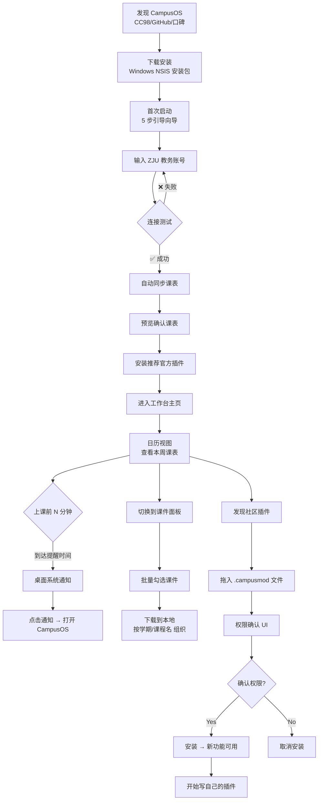

# Execution Plan — ZJU CampusOS

**Date:** 2026-06-17
**Tier:** T3 · S3
**Currency:** CNY (¥)
**Related docs:** [PRD](PRD.md) · [research](research.md) · [技术规格](docs/specs/ideazjuermodapp.md)

> _This is the build roadmap. Someone reading this alone should know exactly what to do Monday morning._

---

## TL;DR

- **MVP:** Electron 桌面工作台 + 插件框架 + 官方教务抓取/日历/课件插件 → 可装可用的 Windows 安装包
- **Platform:** Windows 桌面端 (Electron) — 所有竞品在手机端，桌面是空白；ZJU 工科生在桌边场景天然匹配
- **Stack:** Electron + React 18 + TypeScript 5 + Vite + Zustand + SQLite (better-sqlite3) + Electron safeStorage + Vitest/Playwright
- **Timeline to MVP:** ~8 周（Phase 1 地基 2 周 + Phase 2 核心 4 周 + Phase 3 交付 2 周）
- **First milestone:** hello-world 插件在工作台 UI 中渲染 + `npm run test` 全绿

### Current implementation checkpoint (2026-07-20)

- 已完成内置官方插件路径的 Manifest v2、能力依赖解析、API/权限 fail closed、逐项授权 UI、主进程状态持久化、headless activate/deactivate、刷新 single-flight、分源错误隔离和 provenance repository。
- `zju-undergraduate` 已通过核心不透明业务 Session 发布脱敏身份、真实课表和真实考试 capability；明确日期时间的考试进入工作台，相对考试周记录只保留原始语义，不强制换算日期。密码、Cookie、Session 和 ticket 不进入插件。
- `zju-graduate` 已通过独立 CAS service、一次性 ticket 和主进程内存 token broker 发布研究生 profile、课表、考试和成绩 capability；固定业务操作、精确周次解析、单条容错和缓存局部回退已由外部 HTTP fixture 覆盖，缺少明确钟点的考试不会被补成全天或任意时段。
- `zju-calendar-config` 已从浙江大学官方 HTTPS 页面读取学季边界和开课日，并动态驱动当前/下一学季状态；已内置 ZJU 紫金港标准节次时间表（14 节）作为默认配置数据，供课程日历事件展开使用。
- `academic-timetable-events` 新增为官方无头功能插件，读取课表与校历配置能力，按学季边界、周次、单双周和节次钟点展开为 `calendar.events@1` 课程事件。
- 设置页”诊断与测试”已连接真实刷新协调器和主进程持久化日志，支持查看、清空与自动脱敏 TXT 导出。
- `calendar.events@1` 已实现多 provider collection contract；`academic-exams`、`deadline-assistant` 与 `academic-timetable-events` 作为无头功能插件，按显式刷新依赖把可信考试、DDL 和课程转换为统一事件。工作区只消费事件 feed，不再 import 具体连接器；未验证账号不能命中旧账号事件缓存。
- `zju-undergraduate` 已通过固定成绩查询操作发布 `academic.grades@1`；`academic-grades` 通过受控 capability IPC、运行时依赖授权和已验证账号隔离展示成绩。插件 activity view 现在能自动生成可达导航入口，加权绩点只使用接口明确返回的绩点；成绩页面默认开启隐私遮罩，原始分数显示为 ***，可一键切换显示。
- 设置页首次连接已加入显式本科/研究生培养层次：研究生路径只有在 CAS token 与认证后成绩结构都验证成功后才原子保存 v4 回执，正文和 token 不进入 IPC；旧 v3 本科凭据保持可用。`verify:zju-auth` 可通过 `CAMPUSOS_ZJU_PROGRAM=graduate` 选择研究生脱敏现场测试。
- `.campusmod` 已实现原生文件选择、ZIP/manifest/entrypoint 严格校验、权限审查、10 分钟一次性确认、防换包摘要、原子安装升级、崩溃恢复、逐文件完整性扫描、动态注册和卸载。Electron 已升级至 43.1.1，preload 改为 CJS，主 renderer 开启 Chromium OS sandbox 与严格 CSP；唯一 namespaced activity view + `storage:local` + 无 capability/后台贡献的 profile 可通过独立 `campusmod://` origin iframe 激活，其他包强制停用。
- `zju-learning` 已实现专用业务 Session、固定 `/api/todos` 操作、`learning.assignments@1` 和缓存回退；无截止时间的作业只保留在 capability。2026-07-21 起，引导中已验证账号的 workspace 只从当前账号的正式 capability 记录生成，固定 mock 课程、考试和 DDL 不可进入该路径；核心教务 connector 失败会让同步如实失败。未认证开发路径继续在 fixture 边界内测试。真实账号脱敏验收仍待通过。
- 第三方 headless 已完成 QuickJS/WASM 同步执行内核（含 CPU/内存/堆栈限制与 deadline 中断）；utility process 外层已完成 coordinator/runner/host/protocol 全套进程生命周期、启动/执行超时、外部 RSS 内存监控与崩溃回收，尚未接入 capability/网络权限代理。`.campusmod` 已实现 Ed25519 规范载荷签名验证、安装状态持久化和 UI 展示；签名不建立信任目录，也不开放第三方 headless 生命周期。
- SQLite `DatabaseService` 已完成 v1/v2 migration：工作区快照、官方 capability provenance 与下载队列写入同一数据库，旧 v3 工作区 JSON 和下载队列 JSON 仅作一次性导入；Electron 依赖通过 `rebuild:electron` 重新编译 native binding。
- 5 步首次引导向导已完成：欢迎→连接 ZJU 认证→同步数据→推荐扩展→进入工作台，首次启动自动展示。
- 桌面壳层已调整为固定左侧导航与右侧主内容滚动；周视图在桌面直接填充主内容宽度，窄屏才使用横向滚动。
- - 重试策略：`withRetry` 支持分类（retryable/fatal）、指数退避与 jitter；已集成到刷新协调器各 connector。
- 日历冲突检测：`detectCalendarConflicts` 扫描课程与待办时间轴重叠，标记 overlapping/double-booked 两种严重度。
- 下载引擎：正式 IPC → preload → 工作区快照 → 材料面板调用链已接通；FIFO 队列、并发控制、HTTP Range 断点续传、暂停/恢复/取消和状态广播已用本地 HTTP fixture 覆盖。正式队列存储为 SQLite，旧 JSON 仅在首次读取时迁移；资料 fixture 不再伪造下载进度，未返回 URL 时如实显示为无下载入口。
- 自动更新：electron-updater 集成，GitHub Releases 源，检查/下载/安装 IPC。
- electron-builder 配置：NSIS Windows 安装包，asar 打包，GitHub 发布。
- 考试倒计时插件：消费 `calendar.events@1`，渲染距下一场考试的天数与小时数，<3 天自动标记"临近"。
- 插件开发文档：`docs/plugin-development.md` 覆盖 manifest v2、权限、能力、沙箱、签名模型。
- 已新增 Windows CI（install、typecheck、lint、test、build、Electron native rebuild、Playwright）。2026-07-20 本地复核已通过 typecheck、lint、162 项单测（1 项真实账号测试按环境跳过）、首次引导 Electron E2E 和 x64 NSIS 安装包构建。现场 `verify:zju-auth` 已通过 `live-auth.env` 注入真实账号执行：公共登录页与公钥端点返回 200；Node HTTPS transport 已取代会超时的 Undici fetch，但表单提交阶段收到 ZJUAM 5xx，未建立登录态，因此真实账号验收仍未通过且未输出敏感数据。剩余未完成：其他持久化模块迁入 SQLite、真实账号验收、真实来源 URL 的课件批量下载验收、完整 Playwright 用户链路、第三方 headless capability/网络权限代理与签名、全新 Windows 安装和 GitHub Release/分发验收。`verify:headless-sandbox` 在当前受限环境中启动 Electron 后 124 秒超时且留下子进程，尚未通过；因未获 `Stop-Process` 预授权，未清理残留进程。

---

## 1. User journey — primary flow

### Text walkthrough

**Step 1 — Trigger.** 周日晚上 9 点，大三学生小陈打开笔记本电脑，准备规划下周。他刚刚从 CC98 技术版看到 CampusOS 的帖子，下载了 150MB 的安装包。

**Step 2 — First launch.** 双击打开 CampusOS。欢迎页显示 "CampusOS — ZJU 学生一站式工作台"。点击"开始配置"。

**Step 3 — Auth setup.** 向导要求输入 ZJU 统一认证账号（学号 + 密码）。输入后点击“连接并保存”；只有 ZJUAM、本科教务网业务 Session、素拓正式 `SESSION`、非匿名 `ctx` 和账号匹配的 `getMyInfo` 汇总全部通过，才展示认证后数据回执。密码由 Electron `safeStorage` 加密，Windows 密钥受 DPAPI 保护，明文不落盘。

**Step 4 — Auto sync.** ⏳ "正在拉取课表..." → 进度条走完 → 预览显示："周一 08:00–09:35 高等数学 (紫金港东1A-301)、周一 10:00–11:35 线性代数 (紫金港西2-205)…"共 8 门课。小陈快速扫了一眼："看起来对吗？" → 点击"确认"。

**Step 5 — Plugin recommendations.** 向导推荐安装官方插件：☑ 教务抓取 ☑ 课件下载 ☑ 日历提醒。小陈全选 → "安装选中插件" → 3 秒安装完成。

**Step 6 — Landing.** 进入主界面。导航提供总览、日历、扩展和设置。默认总览以今日课程时间线和待办清单为主体；日历可在月历、线性日程与单日时间线间切换，统一展示课程、作业和考试，悬停事项可查看时间、地点、提交或准备信息。不展示状态栏、同步指标或学期进度卡片。

**Step 7 — Daily use (Monday morning).** 07:45。距离高数课还有 15 分钟，桌面弹出系统通知："📚 高等数学 — 08:00–09:35 紫金港东1A-301"。小陈点击通知，CampusOS 切到前台，仪表盘和日历都能显示今天的安排。这还不是"不漏事"的完全体，但在桌面场景下已经能覆盖最常见的一半提醒需求。

**Step 8 — Download materials.** 周五下午。小陈通过对应官方扩展的入口查看本周高数课更新的 PDF 课件，勾选 → "下载选中" → 进度条走完 → 文件在 `~/CampusOS/materials/2025-2026-夏/高等数学/` 目录下整齐排列。资料能力不再占用一级导航。

**Step 9 — Discovery.** 第二周。小陈在 CC98 上看到有人分享了一个 "ZJU 考试倒计时" 的 `.campusmod` 文件。他拖入 CampusOS 窗口 → 权限列表弹出（仅 `storage:local`）→ 确认安装 → 活动栏多了倒计时入口。他开始想：自己是不是也可以写一个实验室座位监控插件。

### Mermaid diagram

---

## 2. Platform recommendation

**Recommended:** Windows 桌面端 (Electron)

**Why (tied to research and user journey):**

- **竞品盲区。** 超级课程表、今日校园、课程格子、求是潮、Celechron——全部是手机端。没有一家在做 PC 桌面端。这是被验证过的空白象限。
- **用户场景匹配。** 研究显示 ZJU 学生在桌前的学术时间是 CampusOS 核心场景的前提：查课表、下载课件、规划日程发生在桌边，不是在手机上滑两下。如果这个假设被 MVP 数据推翻（用户不希望在 PC 上做这些），则 kill/pivot。
- **VS Code 心智模型复用。** beachhead 用户（ZJU 工科生）每天都在用 VS Code。不需要解释"活动栏""工作台""插件"这些概念——他们已经在肌肉记忆里了。
- **插件生态的天然温床。** 插件的三个前置条件——开发者密度、工具意识、分发渠道——ZJU 计算机/软件工程专业都具备。桌面端 Electron + React 意味着插件开发者用他们已有的技能栈即可开发，零学习成本。

**Alternatives considered:**

- **PWA / 浏览器扩展** — 拒绝了。教务网站有 CORS 限制；浏览器沙箱无法做系统通知和本地文件管理；无法建立"工作台"的心智模型（浏览器 Tab 本身就是 CampusOS 要解决的问题）。
- **Flutter Desktop** — 拒绝了。Flutter Windows 的生态成熟度仍不如 Electron；ZJU 开发者池最熟悉的是 React/TypeScript，不是 Dart。
- **React Native / Expo (移动端)** — 拒绝了作为 MVP 平台，但保留为中期选项。移动端是价值最高的第二平台，但桌面端的"工作台"定位需要先被验证。

**Future platforms:** MVP 跑通后优先添加 **Android Companion**。它的职责不是复制桌面端，而是补齐离开电脑后的最后一公里提醒：课表查看 + 通知 + 课件预览。iOS 不是当前优先级。

---

## 3. Stack recommendation

| Layer | Conservative | Modern (recommended) | Cutting-edge |
|---|---|---|---|
| **Desktop Shell** | Electron (stable) | Electron + Vite | Tauri 2.0 |
| **Frontend** | React 17 + CRA | React 18 + TypeScript 5 + Vite | React 19 + RSC |
| **Styling** | CSS Modules | Tailwind CSS + shadcn/ui | StyleX / Panda CSS |
| **State** | Redux Toolkit | Zustand | Jotai / Zedux |
| **Database** | better-sqlite3 | better-sqlite3 + Drizzle ORM | libSQL (Turso) |
| **Encryption** | Electron safeStorage（当前） | Web Crypto AES-256-GCM + OS-wrapped key | OS-native with TPM |
| **Plugin Sandbox** | 同上下文 iframe | Electron OS sandbox + 独立 custom-protocol origin（renderer）/ worker isolate（headless） | 独立插件进程 + 签名 |
| **Testing** | Jest + manual E2E | Vitest + Playwright | Vitest browser mode |
| **Monitoring** | console.log | Sentry (crash) + PostHog (usage, opt-in) | OpenTelemetry |
| **CI/CD** | GitHub Actions | GitHub Actions + electron-builder | Nix + Earthly |
| **Plugin Packaging** | plain ZIP | .campusmod (ZIP: manifest + code + assets) | signed .campusmod + WASM plugins |

**Recommended:** Modern column across the board. 
- Electron over Tauri for MVP — Tauri 2.0 is the better tech but the ZJU developer pool knows Electron/React better, and "shipping fast" beats "shipping small" right now.
- Zustand over Redux — plugin-friendly lightweight state that doesn't require root reducer boilerplate when a plugin adds its own state.
- 第三方 renderer 使用 Electron Chromium OS sandbox、独立 custom-protocol origin、严格 CSP 和无 preload iframe；这保留浏览器 UI 兼容性，同时不把代码导入宿主上下文。headless/main 在 worker isolate 与资源限制完成前不执行。

**Migration path:**
- Consider **Tauri** when Electron bundle size (150MB+) becomes a documented conversion barrier (measured by installer-abandonment rate > 50%).
- 在开放第三方 headless/main 前完成 **worker isolate** 选型和恶意包 E2E；不能等到真实安全事件发生后再补隔离。
- Consider **PostHog** when WAU > 200 — need funnel analytics; Sentry alone doesn't tell you install → activate → retain.

---

## 4. Phase breakdown

### Phase 1 — MVP: 地基 (weeks 0–2)

**Goal:** Electron 窗口能运行，插件不仅能渲染页面，还能以版本化能力契约安全注册 headless connector。验证"插件工作台 + 数据连接器"架构可行。

**Scope (the thin vertical slice):**
- Electron + React 18 + TypeScript 5 + Vite 项目初始化
- 工作台 UI 骨架（简洁导航 + 主内容区；总览、月历、扩展、设置）
- 插件加载器（.campusmod ZIP 解析 → manifest v2 校验 → 注册到插件注册表）
- `provides/requires/optionalRequires` 能力解析、API 版本检查、循环依赖与 provider 冲突拒绝
- headless connector、sync job、command、settings 和 search provider contribution
- 主进程不透明 service-session request capability；插件永远拿不到密码和 Cookie
- renderer sandbox iframe mount contract + headless worker/isolate
- 权限声明系统（manifest 权限解析 + 安装确认 UI + 运行时检查）
- SQLite 初始化 + database migration 框架
- hello-world 视图插件 + fixture connector → 证明 UI 和 headless capability 两条生命周期
- Vitest 单元测试覆盖核心模块

**Out of scope (tempting but not now):**
- 任何业务功能（教务抓取、日历、课件下载）— 这些是 Phase 2
- 美观 UI — 功能骨架即可，视觉打磨在 Phase 2 做
- 安装包 — Phase 3

**Journey steps covered:** Step 1 (launch App → 看到工作台) — 仅验证技术骨架

**Success metrics:**
- `npm run test` 全绿，覆盖率 > 70%
- `npm run typecheck` TypeScript strict 零错误
- hello-world 插件可见，fixture connector 提供的能力可被消费者解析
- 插件安装/卸载生命周期正常（load → activate → deactivate → unload）
- 缺失依赖、循环依赖、provider 冲突、权限拒绝和 API 不兼容全部 fail closed

**Counter-metrics:**
- 主要功能（活动栏切换、主内容区导航）无明显卡顿 (< 100ms 响应)

**Kill criterion:**
> 如果 2 周内无法让 hello-world 插件在 Electron 窗口中可靠渲染（"可靠" = 10 次冷启动 10 次成功），则考虑放弃 Electron 自研插件框架路线，改为评估是否可以用 VS Code Extension API + VS Code Web 版作为宿主平台。

**How we test it:**
- 开发者自测：`npm run dev` 启动 Electron 窗口 → 手动安装 hello-world.campusmod → 观察渲染
- Vitest 单元测试覆盖插件加载器、manifest 解析、权限解析
- TypeScript strict 编译 CI (GitHub Actions)

**Distribution (where the first users come from):**
- 本阶段不对外分发。仅开发者自测。

**Concrete deliverables:**
- [x] GitHub 仓库初始化 (MIT license + README + CONTRIBUTING)
- [x] Electron + React + Vite + TypeScript 项目骨架可运行
- [x] VS Code 式工作台 UI 可见
- [x] hello-world 插件加载并渲染
- [x] 插件安装/卸载/激活/停用生命周期通过测试
- [x] SQLite 初始化 + migration v1/v2 执行成功
- [x] CI pipeline: typecheck + lint + test + build + Electron E2E

---

### Phase 2 — MVP: 核心 (weeks 2–6)

**Goal:** 完整业务链路跑通：配置账号 → 自动同步课表 → 日历展示 → 课件下载。在 5–10 个真实 ZJU 学生设备上验证端到端可用。

**Scope additions over Phase 1:**
- 5 步首次引导向导 (欢迎 → 账号配置 → 拉取课表 → 推荐插件 → 主页)
- Electron `safeStorage` 凭据加密（Windows DPAPI）
- 按 [Celechron 启发的官方插件集设计](docs/design/celechron-inspired-plugin-suite.md) 实现 Phase 1：`zju-calendar-config`、本科/研究生教务连接器、`zju-learning`、课表、考试、DDL 与日历工作台；禁止继续扩张单体 `academic-scraper`
- 校内数据接入以 Celechron 1.3.0 为强制行为参考：认证后业务身份确认、分源错误隔离、超时/重试/重登、缓存 provenance、刷新互斥、下一学年探测、单条解析隔离和脱敏诊断；具体要求见 [参考基线](docs/references/celechron-1.3.0-ingestion-baseline.md)
- 课件下载引擎（队列管理 + 断点续传 + 进度展示 + 学期/课程名 目录组织）
- 日历组件（月历、线性日程、单日时间线 + 课程/作业/考试统一展示 + 悬停详情）
- 桌面通知系统 + 提醒调度（课前 N 分钟，默认 15 分钟，可配置）
- 抓取容错（失败展示上次缓存数据 + "最后更新于 X 分钟前" + 手动重试按钮）
- Playwright E2E 测试覆盖完整用户流

**Journey steps covered:** Steps 1–8（完整链路：安装 → 引导 → 同步 → 日历 → 课件下载）

**Success metrics:**
- Playwright E2E: 安装 → 引导 → 同步课表 → 日历展示 → 课件下载 → 全部通过
- 引导完成率（内测用户）≥ 60%
- 课表同步首次成功率 ≥ 80%
- 课件下载首次成功率 ≥ 85%
- 内存占用 < 200MB (后台), 冷启动 < 3s

**Counter-metrics:**
- 崩溃率 < 1%（Sentry 监控）
- 无用户报告凭据泄露或明文存储

**Kill criterion:**
> 如果 5 个内测用户在 2 周内无一人完成"引导 → 同步 → 在日历中查看 → 下载至少一个课件"的完整链路，则课表同步的价值假设不成立——用户可能不需要"桌面端自动同步"或者同步体验太差。

**How we test it:**
- 从 CC98 招募 5–10 个 ZJU 本科生作为内测用户
- 观察日志 + Sentry crash 上报
- 每周 1v1 反馈 （"这周用 CampusOS 做了什么？哪里卡住了？"）
- Playwright E2E 覆盖核心流程

**Distribution (Phase 2 开始对用户分发):**
- **Primary channel:** CC98 技术版发帖 — "ZJU 一站式桌面工作台招募内测"
- **Backup channel:** ZJU 实验室/课题组/社团微信群直邀
- **Founder actions this week:** 在 CC98 发帖介绍产品概念 + 放 GitHub 链接 + 附内测报名表单（腾讯问卷 / Google Form）→ 筛选 5–10 人 → 1v1 指导安装
- **CAC estimate:** ¥0（纯 organic 内测），时间成本 ~15h（发帖 + 筛选 + 1v1 指导 + 反馈收集）
- **Signal to switch:** 如果 CC98 发帖 3 天后回复 < 5 人且报名 < 3 人 → 改为线下 1v1 邀请（实验室/社团熟人）

**Concrete deliverables:**
- [x] 5 步引导向导完整可用
- [x] ZJUAM 核心登录 + 本科教务网 Session + 素拓非匿名身份/getMyInfo 回执 + safeStorage 原子持久化
- [ ] 在 5–10 台真实学生设备上完成统一认证成功/失败与网络异常验收
- [x] Plugin Runtime v2 的 connector、能力解析、不透明 Session 请求和 provenance store 通过测试
- [x] `.campusmod` 检查、权限确认、原子安装升级、崩溃恢复、持久注册和卸载通过测试；受限 renderer sandbox v1 可激活，其他第三方执行保持关闭
- [x] 教务课表自动同步（以 capability provenance 和统一课程事件持久化；不再使用独立 `courses` 表）
- [x] 课件批量下载（含断点续传）
- [x] 日历周视图 + 冲突检测
- [x] 桌面通知 + 提醒调度
- [x] 抓取容错（缓存兜底 + 手动重试）
- [ ] Playwright E2E 测试通过

---

### Phase 3 — MVP: 交付 (weeks 6–8)

**Goal:** 可分发可安装的 Windows 安装包 + 插件开发者可上手写第一个插件。

**Scope additions over Phase 2:**
- electron-builder 配置 + NSIS 安装包生成
- electron-updater 自动更新（GitHub Releases）
- Sentry 崩溃上报集成
- 插件开发文档编写（manifest 规范、API 参考、安全模型说明、调试方法）
- 2 个官方示例插件源码（hello-world + 简单网页抓取）
- 插件调试工具（DevTools 面板扩展 / logger）
- 安装包在全新 Windows 10/11 虚拟机上的端到端验证

**Journey steps covered:** Steps 1–9（加入插件发现和安装）

**Success metrics:**
- `npm run build` 构建成功，生成 Windows NSIS .exe 安装包
- 安装包体积 < 200MB（压缩后）
- 插件开发文档由至少 1 名外部开发者验证"可从头创建插件"
- 2 个官方示例插件可被加载运行
- 全新 Windows VM 上完成完整引导流程

**Counter-metrics:**
- 安装包不应触发 Windows Defender 误报（至少提交审核）

**Kill criterion:**
> 如果 8 周结束仍无法生成一个可在全新 Windows 上正常安装运行的 `.exe`，则不进入公开发布阶段——继续修复打包问题。这不是 kill 整个产品，而是不进入"公开发布"阶段。

**How we test it:**
- 在 VirtualBox/VMware 全新 Windows 10 + Windows 11 虚拟机中安装测试
- 模拟"从未安装过 Node.js/Electron"的普通学生电脑环境
- 插件开发文档由一个不熟悉项目的开发者（可以是朋友）按照文档尝试创建插件

**Distribution:**
- **Primary channel:** GitHub Releases 页面公开发布 v0.1.0
- **Promotion:** CC98 正式发布帖（不再是"内测" → "正式发布"）+ 产品截图 + 3 分钟视频 demo
- **Founder actions this week:** 录制产品 demo 视频 → 写 CC98 发布帖 → 准备可分享的文案（一段话 + 3 张图）→ 推送到个人 GitHub README 和朋友圈
- **CAC estimate:** ¥0
- **Signal to switch:** 如果 GitHub Release 发布 1 周后下载量 < 30，则评估是否需要额外推广渠道

**Concrete deliverables:**
- [x] Windows NSIS 安装包构建成功
- [x] electron-updater 配置就绪
- [x] Sentry crash reporting 集成
- [x] 插件开发文档完整
- [x] 2 个示例插件源码 + README
- [ ] GitHub Release v0.1.0 发布
- [ ] CC98 发布帖上线

---

### Phase 4 — v1 (weeks 8–20)

**Goal:** 从"能用"到"好用"；从 10 个内测用户到 500 WAU；核心框架稳定到足以吸引社区贡献者；验证留存和口碑。

**Scope additions over MVP:**
- UI 打磨（主题系统：亮色/暗色/高对比度；动画过渡；键盘快捷键）
- 官方成绩看板插件 (GPA tracker)
- 官方考试倒计时插件
- 插件热更新（不重启 App 更新插件）
- 用户反馈通道（App 内 feedback 按钮 → GitHub Issues template）
- 备选教务登录方案（Cookie 导入 + 浏览器扩展辅助 — 防验证码）
- 插件安装体验优化（应用内搜索 + 一键安装链接）
- 钉钉登录/消息导入入口占位（先预留入口，具体实现后续参考现成软件方案）
- 可选的匿名使用数据收集 (PostHog opt-in, 仅功能漏斗, 不含个人数据)

**Journey steps covered:** 所有 MVP 步骤 + 插件发现和安装体验优化

**Success metrics:**
- WAU ≥ 500
- D7 留存 ≥ 30%
- 人均安装插件 ≥ 3 个
- NPS ≥ 40
- 社区插件数量 ≥ 5 个（非官方）
- 自动更新成功率 ≥ 95%

**Counter-metrics:**
- 崩溃率 ≤ 0.5%
- 无安全漏洞报告
- 无隐私投诉

**Kill criterion:**
> 如果 v1 结束时（20 周）WAU < 100 且 D7 留存 < 15%，则 CampusOS 没有形成习惯性使用。考虑 pivot：放弃工作台野心，将教务抓取功能独立出来做成轻量级桌面小工具（仅课表同步 + 提醒），降低用户预期和开发复杂度。

**Distribution (what changes from MVP):**
- Primary channel: CC98 口碑 + GitHub Stars + ZJU 校内口碑传播
- New channels to test: ZJU 新生群秋季推广（8–9 月入学季）；B 站 ZJU Up 主合作 demo 视频
- Founder actions this phase: 在 CC98 维持活跃（回复反馈、发布更新日志）；与 2–3 个 ZJU 技术爱好者建立贡献者关系
- CAC target: 仍保持 ¥0 organic；如果 B 站渠道尝试，预算 ≤ ¥500
- Signal to switch: 如果 ZJU 口碑传播不达预期，启动其他浙江高校（杭电、浙工大）作为第二校试点

**Concrete deliverables:**
- [ ] 亮色/暗色主题切换
- [x] 成绩看板首个纵向切片（原始成绩、显式绩点加权、真实刷新与账号隔离）
- [ ] 成绩多口径、主修标记、隐私遮罩与真实账号验收
- [ ] 考试倒计时插件
- [ ] 插件热更新
- [ ] App 内 feedback 通道
- [ ] Cookie 导入方案（备选登录）
- [ ] 钉钉登录/消息导入入口占位
- [ ] 至少 5 个社区贡献插件
- [ ] PostHog funnel analytics (opt-in)

---

### Phase 5 — Target state (beyond v1, months 6–18)

**Vision (written in present tense — what this looks like when it's working):**

> CampusOS 是 ZJU 学生打开电脑后第一个启动的应用。它不只是一个课表工具——它是整个校园数字生活的桌面中枢。早上 7:50 它提醒你第一节高数课在 10 分钟后开始；课间你一键下载了教授刚上传的 PDF 课件；午休时你在日历里添加了晚上的社团例会；下午你发现 CC98 上有人分享了一个"ZJU 图书馆实时座位图"插件，拖入后立刻可用；期末考试前，成绩看板帮你追踪 GPA 变化趋势，AI 插件根据历史考试数据给你排了复习优先级。
>
> 社区有 20+ 个活跃插件贡献者，覆盖了计算机学院院网、云峰学院院网、ETA 三全育人平台、教务处网站等核心信息源。三个其他 985 高校的学生自发组织了 CampusOS 适配小组，每个学校有了自己的教务抓取插件。安卓 Companion 补齐了离开电脑后的提醒闭环，桌面端负责规划/归档，手机端负责最后一公里提醒。
>
> 项目保持完全开源，不以内置收费或插件抽成为目标；维护依靠个人投入和社区贡献。如果未来需要插件目录，也优先走开源、非商业分发路线。

**Key capabilities to build toward:**
- 开源插件目录 / 插件索引（非商业，支持搜索、签名、版本元数据）
- 用户账户系统（仅在确有需求时引入可选云同步 — 端到端加密传输）
- AI 插件生态（AI 课表优化建议、AI 考试预测、AI 课件摘要——利用 LLM Agent 能力）
- 跨校适配框架（插件开发者可配置不同学校的教务接口）
- 钉钉登录 / 消息导入（先从入口和授权壳子做起，具体实现后续补齐）
- 移动端 Companion App（Android 优先，仅课表查看 + 通知 + 课件预览）
- 插件数字签名验证
- 团队协作功能（可共享日历事件给课题组成员）

**Scale metrics:**
- WAU ≥ 4,000 (ZJU 本科生 15%)
- 扩展到 3+ 所高校
- 社区插件 ≥ 50 个
- 关键官方信息源覆盖 ≥ 10
- Android Companion 发布
- NPS ≥ 50

---

## 5. Metrics rollup (all phases)

| Phase | North Star | Target | Kill threshold | Key inputs |
|---|---|---|---|---|
| Phase 1 (MVP 地基) | hello-world 插件在 Electron 中渲染 | `npm run test` 全绿 | 2 周内无法可靠渲染 → 评估替代方案 | typecheck 零错误, 插件生命周期测试通过 |
| Phase 2 (MVP 核心) | 引导完成率 | ≥ 60% (内测) | 内测用户无一人完成完整链路 → 价值假设不成立 | 课表同步成功率 ≥ 80%, 下载成功率 ≥ 85% |
| Phase 3 (MVP 交付) | Windows .exe 构建成功 | 安装包 < 200MB | 8 周仍无可用安装包 → 不进入公开发布 | 全新 Win VM 引导通过, 外部开发者验证文档 |
| Phase 4 (v1) | WAU | ≥ 500 | WAU < 100 且 D7 < 15% → pivot 轻量工具 | D7 留存 ≥ 30%, 人均插件 ≥ 3, 社区插件 ≥ 5 |
| Phase 5 (Target) | WAU | ≥ 4,000 | — | 跨 3+ 高校, 社区插件 ≥ 50, 关键官方信息源覆盖 ≥ 10, Android Companion 发布 |

---

## 6. Immediate next steps (private alpha)

1. **保持本地完整流程 E2E 为发布门禁** — 已完成。`pnpm --filter @campusos/core test:e2e` 构建专用 `e2e` renderer，并在外部校历 HTTP adapter 边界使用 fixture；测试经过 Electron IPC、插件运行时、SQLite 工作区和日历渲染，不能用 renderer 假成功替代。

2. **结案真实本科认证故障** — 下一步。以脱敏 `verify:zju-auth` 证据在至少两个时段或网络复测，区分 ZJUAM 服务异常、协议变化、网络限制和实现缺陷。认证成功前不新增连接器或插件功能。

3. **执行 3 人 / 3 设备私有 Alpha** — 依赖步骤 2。每名本科生在真实 Windows 设备上完成安装、认证、同步、日历查看和一次提醒；记录步骤、结果和脱敏诊断，而不是仅记录是否安装。

4. **作出发布 Go/No-Go 决策** — 依赖步骤 3。只有[私有 Alpha 验收门槛](docs/alpha-acceptance.md)全部通过，才进入 GitHub Release 与 CC98 招募；否则只修复验收暴露的问题。

---

## 7. Open decisions (to make this week)

- **JS 沙箱方案** — renderer 已选择 Electron OS sandbox + 独立 `campusmod://` origin iframe；headless 内层已选择 QuickJS/WASM 并完成 CPU/普通 JS 堆 POC，外层采用 utility process 的崩溃回收、外部内存限制与权限代理仍待落地
- **插件注册表格式** — 选项: manifest.json 纯本地 / 远程 registry URL / 本地 + 远程 — 推荐: V1 纯本地 manifest.json（`.campusmod` 文件内嵌），因为 V1 没有后端
- **日历组件选择** — 选项: FullCalendar / React Big Calendar / 自研 — 推荐: FullCalendar (React wrapper)，因为周视图/日视图/冲突检测都是内置功能，自研成本远高于集成
- **图标方案** — 选项: VS Code Icons (Codicons) / Phosphor / Lucide / Font Awesome — 推荐: Phosphor，因为 MIT 许可 + React 原生支持 + 风格现代 + 包体积小
- **首批信息源边界** — 选项: 全量校内站点 / 4 个核心源 / 仅教务 — 推荐: 4 个核心源（教务处、计院院网、云峰院网、ETA），因为能覆盖高价值又能避免工程面过宽
- **钉钉登录/消息导入** — 选项: 当前实现 / 先做入口占位 / 暂不支持 — 推荐: 先做入口占位，等待后续参考现成软件方案

---

## 8. Risks for execution (beyond the product risks in PRD)

| Risk | Likelihood | Impact | Mitigation |
|---|---|---|---|
| 单人开发进度风险 — 8 周 MVP 可能超期 | 中 | 中 | 严格按 Phase 优先级：如果延期，砍 Phase 3 的"插件调试工具"和"2 个示例插件"，保安装包 |
| 教务系统 DOM 结构频繁变化 | 中 | 中 | 设计插件时把 DOM 选择器抽成配置；提供选择器热更新（不更新插件本体） |
| 课表同步成功后，用户没有持续打开的习惯 | 中 | 高 | 桌面通知是 MVP 阶段最主要的拉回机制——必须做到尽可能可靠；离开电脑后的完整闭环由后续 Android Companion 补齐 |
| CC98 社区反馈冷淡 | 低 | 中 | 如果社区反馈不足，改为线下 1v1；熟人比陌生人更愿意给真实反馈 |

---

_Changelog_
- 2026-06-17: initial draft — incorporating Lisa's phase breakdown + metrics framework + kill criteria
- 2026-07-12: synced with clarified direction — official integrations first, full open-source/non-commercial stance, Android as post-MVP reminder completion, prioritized data sources, DingTalk import added to research scope
